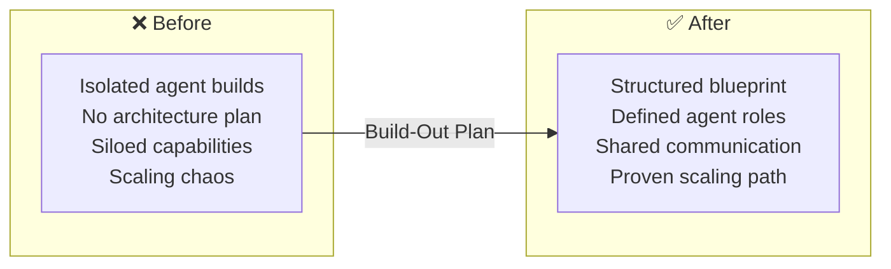
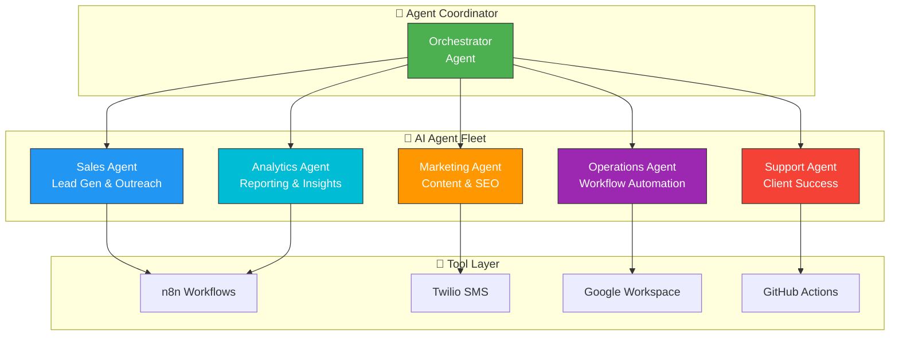

# 🤖 SparkSphear AI Agent Build-Out

> **The blueprint and build orchestration for the SparkSphear AI agent fleet**  
> Multi-agent architecture planning, deployment scripts, and agent coordination.

---

## ❌ The Problem

Building an AI agent fleet isn't a single project — it's a coordinated effort across multiple agents, each with specialized roles. Without a blueprint, agents are built in isolation, don't communicate, and create more chaos than order. Teams struggle with: which agent does what, how agents hand off tasks, and how to scale from one agent to an entire fleet.

**Before:** Ad-hoc agent builds, no shared architecture, siloed agent capabilities, no coordination pattern, scaling chaos.

**After (AI Agent Blueprint):** A structured build-out plan with clearly defined agent roles, communication protocols, and a proven scaling path from 1 to N agents — starting with Sales, Marketing, Operations, Support, and Analytics.

---

## 🔄 Before vs After

## 🧠 AI Agent Fleet Architecture

Built by **[Shazaly Musa](https://github.com/SparkSpheartech)** — Founder, SparkSphear Tech  
*AI Agent Fleet Orchestration*